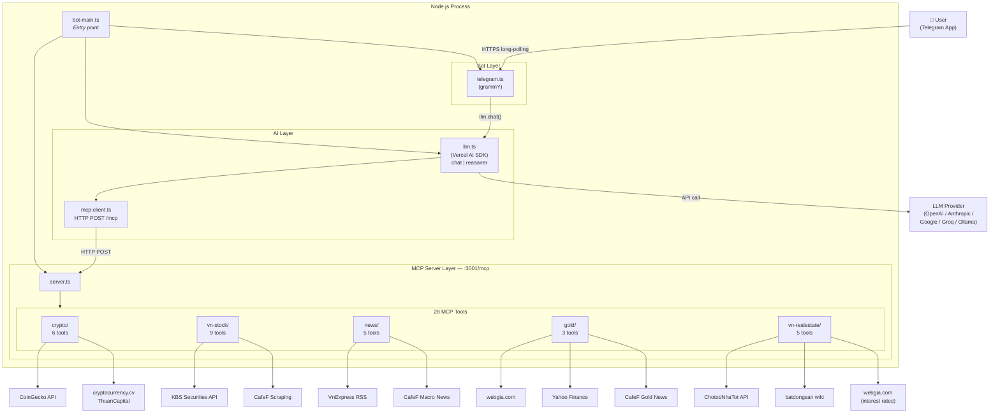

# BietTuotBot — Telegram Chatbot Phân Tích Tin Tức & Tài Chính

Bot Telegram thông minh tích hợp AI để phân tích tin tức, thị trường chứng khoán Việt Nam, crypto, vàng và bất động sản. Tổng hợp dữ liệu từ 10+ nguồn (VnExpress, CafeF, KBS Securities, CoinGecko, cryptocurrency.cv, ThuanCapital, webgia.com, Yahoo Finance, Chotot/NhaTot, batdongsan wiki) qua **28 MCP tools**. Hỗ trợ mọi LLM provider (OpenAI, Anthropic, Google Gemini, Ollama v.v...) với 2 chế độ AI (chat nhanh + reasoner phân tích sâu).

---

## Tính năng

- **Tin tức thời sự**: Crawl RSS từ VnExpress (thế giới, kinh doanh, thời sự, bất động sản, pháp luật...)
- **Tin tức tài chính**: Tin vĩ mô, chứng khoán, ngân hàng, quốc tế, vàng/hàng hóa từ CafeF
- **Phân tích sâu**: AI đọc nội dung full bài viết từ nhiều nguồn, đưa ra nhận định độc lập đa chiều
- **Crypto market**: Giá BTC/ETH/SOL... theo thời gian thực, phân tích kỹ thuật (RSI/MACD/SMA/EMA/ATH/ATL) từ CoinGecko
- **Crypto news**: Tin crypto quốc tế (200+ nguồn EN) + tin & kiến thức crypto tiếng Việt từ ThuanCapital
- **Chứng khoán VN**: VNINDEX, HNX, UPCOM, giá cổ phiếu, dòng tiền ngoại, profile công ty, giao dịch nội bộ, chỉ số tài chính từ KBS Securities + CafeF
- **Phân tích kỹ thuật cổ phiếu**: SMA/EMA/RSI/MACD/ATH/ATL tính tự động từ dữ liệu OHLCV
- **Giá vàng**: Giá vàng nội địa VN (SJC, DOJI, PNJ...) + giá vàng thế giới, phân tích kỹ thuật vàng (RSI/SMA/EMA/MACD từ Yahoo Finance GC=F), tin tức vàng từ CafeF
- **Bất động sản VN**: Lãi suất tiết kiệm 29+ ngân hàng, tin BĐS từ CafeF + batdongsan wiki, tìm kiếm & xem chi tiết tin đăng BĐS trên Chotot/NhaTot
- **2 chế độ AI**: Chat mode (nhanh, data-forward) + Reasoner mode (phân tích sâu, đa chiều, nhận định độc lập)
- **Hội thoại liên tục**: Nhớ ngữ cảnh theo từng chat — có thể hỏi tiếp mà không cần giải thích lại
- **Đa provider LLM**: Đổi model chỉ cần sửa biến môi trường, không cần thay code
- **Access control**: Quản lý whitelist user, admin có thể /allow và /block trực tiếp trên Telegram

### Lệnh bot

| Lệnh                 | Mô tả                                                          |
| -------------------- | -------------------------------------------------------------- |
| `/news [chủ đề]`     | Tin tức mới nhất, có thể lọc theo chủ đề                       |
| `/stock`             | Tổng quan thị trường chứng khoán VN (VNINDEX, top, dòng ngoại) |
| `/crypto`            | Tổng quan thị trường crypto (BTC dominance, top 10, trending)  |
| `/gold`              | Giá vàng nội địa VN + vàng thế giới                            |
| `/bds`               | Tin tức & thông tin thị trường bất động sản VN                 |
| `/analysis [chủ đề]` | 🧠 Phân tích chuyên sâu (reasoner mode)                        |
| `/status`            | Thông tin bot: model, chat ID, lịch sử hội thoại               |
| `/reset`             | Xóa lịch sử hội thoại                                          |
| `/allow <chat_id>`   | _(Admin)_ Cấp quyền truy cập cho user                          |
| `/block <chat_id>`   | _(Admin)_ Thu hồi quyền truy cập                               |
| `/users`             | _(Admin)_ Danh sách user được phép                             |
| Tin nhắn tự do       | Hỏi bất cứ điều gì về tin tức / tài chính                      |

> Tin nhắn chứa từ khóa "phân tích", "tại sao", "xu hướng"... tự động chuyển sang reasoner mode.

---

## Kiến trúc

Toàn bộ hệ thống chạy trong **một Node.js process duy nhất**:



**Luồng xử lý một tin nhắn:**

1. User gửi tin → `telegram.ts` nhận, auto-detect mode (chat/reasoner) theo từ khóa
2. `telegram.ts` gọi `llm.chat(chatId, message, notifyUser, mode)` → hiển thị typing indicator
3. `llm.ts` gọi `generateText()` (Vercel AI SDK) với system prompt + 28 MCP tools
4. AI quyết định tool cần gọi → `mcp-client.ts` HTTP POST đến `:3001/mcp`
5. `server.ts` tạo MCP instance mới mỗi request, dispatch đến topic tool tương ứng
6. Tool fetch dữ liệu từ external API/scraper → trả kết quả (có cache + retry)
7. AI lặp steps 4–6 tối đa 7 lần (MAX_STEPS), tổng hợp → sinh phản hồi cuối
8. `telegram.ts` convert Markdown→HTML, split nếu > 4096 ký tự, gửi lại User

### 28 MCP Tools

| Nhóm                | Tool                             | Mô tả                                                                      |
| ------------------- | -------------------------------- | -------------------------------------------------------------------------- |
| **VnExpress**       | `vnexpress_get_latest_news`      | Tin mới nhất theo chuyên mục (8 categories)                                |
|                     | `vnexpress_search_news`          | Tìm kiếm bài viết theo keyword                                             |
|                     | `vnexpress_get_article_content`  | Đọc nội dung full bài viết                                                 |
| **Crypto**          | `crypto_get_overview`            | Tổng quan thị trường: market cap, BTC dominance, top 10, trending          |
|                     | `crypto_get_prices`              | Giá realtime cho list coin cụ thể                                          |
|                     | `crypto_get_technical`           | Phân tích kỹ thuật: RSI, SMA, EMA, MACD, ATH/ATL                           |
| **Crypto News**     | `cryptocurrency_get_news`        | Tin crypto EN từ 200+ nguồn quốc tế                                        |
|                     | `thuancapital_get_news`          | Tin crypto VN: tin-tuc (tin/phân tích) hoặc kien-thuc (kiến thức/giáo dục) |
|                     | `thuancapital_get_article`       | Đọc full bài viết ThuanCapital                                             |
| **Stock VN**        | `stock_vn_overview`              | Top khối lượng + dòng tiền ngoại                                           |
|                     | `stock_get_ohlcv`                | OHLCV lịch sử (1 mã, N ngày)                                               |
|                     | `stock_get_index`                | OHLCV index (VNINDEX/HNX/UPCOM/VN30)                                       |
|                     | `stock_price_board`              | Bảng giá realtime nhiều mã cùng lúc                                        |
|                     | `stock_get_profile`              | Profile công ty: ngành, sàn, vốn, mô tả                                    |
|                     | `stock_get_technical`            | Phân tích kỹ thuật: SMA/EMA/RSI/MACD/ATH/ATL                               |
| **CafeF**           | `cafef_get_macro_news`           | Tin vĩ mô: chứng khoán, vĩ mô, quốc tế, vàng/hàng hóa, ngân hàng           |
|                     | `cafef_get_article_content`      | Đọc full bài viết CafeF                                                    |
|                     | `cafef_get_company_news`         | Tin tức & sự kiện công ty                                                  |
|                     | `cafef_get_insider_trading`      | Giao dịch cổ đông nội bộ & lớn                                             |
|                     | `cafef_get_financials`           | Chỉ số tài chính: EPS, P/E, P/B, vốn hóa                                   |
| **Vàng**            | `gold_get_prices`                | Giá vàng nội địa VN (SJC, DOJI, PNJ...) + giá vàng thế giới (webgia.com)   |
|                     | `gold_get_news`                  | Tin tức thị trường vàng từ CafeF (JSON API)                                |
|                     | `gold_get_technical`             | Phân tích kỹ thuật vàng thế giới: RSI/SMA/EMA/MACD (Yahoo Finance GC=F)    |
| **Bất động sản VN** | `realestate_get_interest_rates`  | Lãi suất tiết kiệm 29+ ngân hàng VN, 10 kỳ hạn (webgia.com)                |
|                     | `realestate_get_news`            | Tin BĐS từ CafeF + batdongsan wiki (lọc 60 ngày)                           |
|                     | `realestate_get_article_content` | Đọc full bài viết batdongsan wiki                                          |
|                     | `realestate_search_listings`     | Tìm kiếm tin đăng BĐS trên Chotot/NhaTot (gateway.chotot.com)              |
|                     | `realestate_get_listing_detail`  | Xem chi tiết tin đăng BĐS từ Chotot/NhaTot theo listing ID                 |

---

## Onboarding — Chạy từ đầu

### Yêu cầu

- **Node.js** >= 18 (khuyến nghị v22)
- **npm** >= 8
- Telegram Bot Token (lấy từ [@BotFather](https://t.me/BotFather))
- API key của LLM provider (OpenAI / Anthropic / Google / Groq / Ollama...)

### Bước 1 — Clone và cài dependencies

```bash
git clone <repo-url>
cd biettuotbot
npm install
```

### Bước 2 — Tạo file `.env`

Tạo file `.env` từ template:

```bash
cp .env.example .env
```

Mở `.env` và điền thông tin:

```env
# Telegram
TELEGRAM_BOT_TOKEN=7xxxxxx:AAxxxxxxxxxxxxxxxx

# LLM Provider — Chat mode (chọn 1 trong các provider bên dưới)
AI_PROVIDER=openai
AI_MODEL=gpt-4o
AI_API_KEY=sk-xxxxxxxxxxxxxxxx
AI_BASE_URL=

# LLM Provider — Reasoner mode (tuỳ chọn, nếu muốn dùng model khác cho phân tích sâu)
AI_REASONER_MODEL=
AI_REASONER_API_KEY=
AI_REASONER_BASE_URL=

# MCP Server
MCP_SERVER_URL=http://localhost:3001/mcp
PORT=3001

# Telegram Access Control
# ADMIN_CHAT_ID: chat ID của bạn (dùng @userinfobot để lấy)
# ALLOWED_CHAT_IDS: danh sách chat ID được phép dùng bot (phân cách bằng dấu phẩy)
ADMIN_CHAT_ID=123456789
ALLOWED_CHAT_IDS=123456789
```

**Lấy Telegram Chat ID:** Mở [@userinfobot](https://t.me/userinfobot) trên Telegram → gửi `/start` → bot trả về chat ID của bạn.

### Bước 3 — Chọn LLM provider

Sửa 3 biến `AI_PROVIDER`, `AI_MODEL`, `AI_API_KEY` trong `.env`:

| Provider                 | AI_PROVIDER | AI_MODEL                   | AI_BASE_URL                      |
| ------------------------ | ----------- | -------------------------- | -------------------------------- |
| OpenAI                   | `openai`    | `gpt-4o`                   | _(để trống)_                     |
| Anthropic                | `anthropic` | `claude-sonnet-4-20250514` | _(để trống)_                     |
| Google Gemini            | `google`    | `gemini-2.0-flash`         | _(để trống)_                     |
| DeepSeek                 | `openai`    | `deepseek-chat`            | `https://api.deepseek.com`       |
| DeepSeek V3.2 + Thinking | `openai`    | `deepseek-reasoner`        | `https://api.deepseek.com`       |
| Groq (miễn phí)          | `openai`    | `llama-3.1-70b-versatile`  | `https://api.groq.com/openai/v1` |
| Ollama (local)           | `openai`    | `llama3`                   | `http://localhost:11434/v1`      |

> **Tip:** Có thể dùng model nhanh (DeepSeek Chat / GPT-4o) cho chat mode và model mạnh hơn (DeepSeek Reasoner / Claude) cho reasoner mode bằng cách cấu hình `AI_REASONER_MODEL`, `AI_REASONER_API_KEY`, `AI_REASONER_BASE_URL`.

### Bước 4 — Build và chạy

**Chạy development (có hot-reload):**

```bash
npm run build       # compile TypeScript → lib/
npm run dev:bot     # chạy bot (nodemon)
```

**Hoặc chạy production:**

```bash
npm run build
npm run start:bot
```

Khi thấy log:

```
MCP server started on port 3001
Loaded 28 MCP tools
Telegram bot started
```

→ Bot đã sẵn sàng. Mở Telegram, tìm bot của bạn, gửi `/start`.

### Bước 5 — Kiểm tra

Gửi thử các lệnh trong Telegram:

```
/market                              → tổng quan thị trường
/news vàng                           → tin tức về vàng
/analysis Bitcoin                    → phân tích chuyên sâu (reasoner mode)
/plan crypto                         → trading plan crypto
/status                              → xem model đang dùng, chat ID
Tại sao Bitcoin tăng mạnh hôm nay?   → câu hỏi tự do (auto reasoner mode)
FPT đang giá bao nhiêu?              → giá cổ phiếu (auto chat mode)
Giá vàng SJC hôm nay?               → giá vàng nội địa
Lãi suất tiết kiệm Vietcombank?     → lãi suất ngân hàng
Tìm nhà bán ở Quận 7 HCM            → tìm BĐS trên Chotot
```

---

## Cấu trúc project

```
src/
├── bot-main.ts          # Entry point — khởi động MCP server + Telegram bot
├── server.ts            # MCP server — thin orchestrator, đăng ký 28 tools
├── llm.ts               # LLM wrapper (Vercel AI SDK) — tool-use loop, chat history, retry logic
├── telegram.ts          # Telegram bot layer (grammY) — lệnh, access control, auto mode detection
├── mcp-client.ts        # MCP HTTP client — kết nối đến MCP server
├── index.ts             # Standalone MCP server entry (không có bot, dùng cho inspector/test)
├── prompts/
│   ├── system.ts        # CHAT_SYSTEM_PROMPT, REASONER_SYSTEM_PROMPT, TOOL_ROUTING
│   ├── commands.ts      # Per-command prompt builders (/news, /market, /plan, /analysis)
│   └── index.ts         # Re-exports
└── tools/
    ├── index.ts         # registerAllTools(server) — gọi 5 topic registers + cache warmup
    ├── _shared/
    │   └── http.ts      # Shared axios instances (http, kbsHttp, coingeckoHttp) + utils
    ├── crypto/
    │   ├── crypto-market.ts    # CoinGecko: prices, top coins, global data, trending
    │   ├── crypto-technical.ts # CoinGecko OHLC + RSI/SMA/EMA/MACD calculations
    │   ├── crypto-news.ts      # cryptocurrency.cv RSS + ThuanCapital scraping
    │   └── index.ts            # registerCryptoTools(server) — 6 tools
    ├── vn-stock/
    │   ├── stock-market.ts     # KBS Securities: OHLCV, price board, profile + CafeF financials
    │   ├── stock-technical.ts  # SMA/EMA/RSI/MACD computation + ATH/ATL từ full history
    │   ├── stock-news.ts       # CafeF: company news + insider trading
    │   └── index.ts            # registerVnStockTools(server) — 9 tools
    ├── news/
    │   ├── vnexpress.ts        # VnExpress RSS feeds + article content + search
    │   ├── macro-news.ts       # CafeF macro/market news by category
    │   ├── article-reader.ts   # CafeF full article content reader
    │   └── index.ts            # registerNewsTools(server) — 5 tools
    ├── gold/
    │   ├── gold-market.ts      # webgia.com: giá vàng nội địa VN + giá vàng thế giới
    │   ├── gold-technical.ts   # Yahoo Finance GC=F: RSI/SMA/EMA/MACD cho vàng thế giới
    │   ├── gold-news.ts        # CafeF gold news JSON API
    │   └── index.ts            # registerGoldTools(server) — 3 tools
    └── vn-realestate/
        ├── realestate-interest.ts  # webgia.com: lãi suất tiết kiệm 29+ ngân hàng VN
        ├── realestate-news.ts      # CafeF BĐS + batdongsan wiki news + article reader
        ├── realestate-listings.ts  # Chotot/NhaTot: tìm kiếm + chi tiết tin đăng BĐS
        └── index.ts                # registerVnRealestateTools(server) — 5 tools
```

| File/Folder            | Vai trò                                                                     |
| ---------------------- | --------------------------------------------------------------------------- |
| `bot-main.ts`          | Orchestrator — start server và bot, validate env vars, trigger cache warmup |
| `telegram.ts`          | UI layer — nhận lệnh, auto-detect mode, gửi trả lời, access control         |
| `llm.ts`               | AI brain — tool-use loop, quản lý lịch sử, strip tool results, retry        |
| `mcp-client.ts`        | Bridge — chuyển tool call từ AI xuống MCP server qua HTTP                   |
| `server.ts`            | Tool registry — thin orchestrator gọi registerAllTools()                    |
| `tools/_shared/`       | Shared axios instances + isFresh(), fetchWithRetry(), logTool()             |
| `tools/crypto/`        | CoinGecko API: giá, technical analysis, tin crypto EN + ThuanCapital VN     |
| `tools/vn-stock/`      | KBS Securities + CafeF: OHLCV, giá, profile, kỹ thuật, tin công ty, nội bộ  |
| `tools/news/`          | VnExpress RSS + CafeF macro news + full article reader                      |
| `tools/gold/`          | Giá vàng nội địa + thế giới, phân tích kỹ thuật vàng, tin tức vàng          |
| `tools/vn-realestate/` | Lãi suất ngân hàng, tin BĐS, tìm kiếm & chi tiết tin đăng BĐS Chotot/NhaTot |

---

## Nguồn dữ liệu & Cache

| Nguồn                    | Sử dụng bởi                                        | Cache TTL                          |
| ------------------------ | -------------------------------------------------- | ---------------------------------- |
| CoinGecko REST API       | crypto-market, crypto-technical                    | 3 min (prices), 5 min (OHLC)       |
| KBS Securities API       | stock-market, stock-technical                      | 5 min (OHLCV), 1 min (price board) |
| CafeF HTML scraping      | stock-news, macro-news, article-reader, financials | 5 min                              |
| VnExpress RSS            | vnexpress                                          | 5 min (feeds), 60 min (articles)   |
| cryptocurrency.cv RSS    | crypto-news                                        | 5 min                              |
| ThuanCapital HTML        | crypto-news                                        | 5 min                              |
| webgia.com HTML scraping | gold-market, realestate-interest                   | 5 min (gold), 30 min (rates)       |
| Yahoo Finance API        | gold-technical (GC=F futures OHLC)                 | 5 min                              |
| CafeF Gold News JSON API | gold-news                                          | 10 min                             |
| CafeF BĐS HTML scraping  | realestate-news                                    | 5 min                              |
| batdongsan wiki scraping | realestate-news, realestate-article                | 5 min (news), 1 hr (articles)      |
| Chotot/NhaTot JSON API   | realestate-listings                                | 5 min (listings), 30 min (detail)  |

---

## Debug với MCP Inspector

Để test các tool trực tiếp (không qua bot):

```bash
npm run dev:http       # khởi động MCP server standalone tại :3001
npm run dev:inspector:http   # mở MCP Inspector tại localhost:5173
```

Trình duyệt mở → click **Connect** → **List Tools** → chọn tool → điền params → **Run Tool**.

---

## Infra & Deployment

Bot được deploy trên **AWS EC2** (`ap-southeast-1` — Singapore) qua Docker + ECR + GitHub Actions + Terraform.

### CI/CD Flow

```
git push origin main
  → GitHub Actions: checkout → AWS credentials → ECR login → docker build → docker push
  → SSH vào EC2 → docker pull → docker stop/rm container cũ → docker run --env-file .env
  → Prune image cũ tự động
```

### File liên quan

| File                           | Mục đích                                                                 |
| ------------------------------ | ------------------------------------------------------------------------ |
| `Dockerfile`                   | Multi-stage build: `builder` (npm ci + tsc), `production` (runtime only) |
| `docker-compose.yml`           | Local dev only — mounts `.env`, log rotation 10m/3 files                 |
| `.dockerignore`                | Loại trừ `node_modules`, `lib`, `.git`, `.env`, `infra`, `*.md`...       |
| `.github/workflows/deploy.yml` | CI/CD: push `main` → build → ECR push → SSH deploy EC2                   |
| `infra/*.tf`                   | Terraform IaC: EC2 t3.micro, ECR, IAM, SG, EIP, 30 GB gp3                |

### Chạy với Docker (local)

```bash
# Build & chạy local
docker compose up --build

# Hoặc build riêng
docker build -t biettuotbot .
docker run --env-file .env biettuotbot
```

### Terraform commands

```bash
cd infra/
terraform init
terraform plan
terraform apply
terraform output ec2_public_ip
```

---

## Biến môi trường — đầy đủ

| Biến                   | Bắt buộc | Mô tả                                                    |
| ---------------------- | -------- | -------------------------------------------------------- |
| `TELEGRAM_BOT_TOKEN`   | ✅       | Token từ @BotFather                                      |
| `AI_PROVIDER`          | ✅       | `openai` \| `anthropic` \| `google`                      |
| `AI_MODEL`             | ✅       | Tên model chat, vd: `gpt-4o`                             |
| `AI_API_KEY`           | ✅       | API key của provider                                     |
| `AI_BASE_URL`          | ❌       | Custom endpoint (Ollama, Groq, DeepSeek...)              |
| `AI_REASONER_MODEL`    | ❌       | Model cho reasoner mode (fallback: dùng AI_MODEL)        |
| `AI_REASONER_API_KEY`  | ❌       | API key riêng cho reasoner (fallback: dùng AI_API_KEY)   |
| `AI_REASONER_BASE_URL` | ❌       | Base URL riêng cho reasoner (fallback: dùng AI_BASE_URL) |
| `COINGECKO_API_KEY`    | ❌       | CoinGecko demo API key (rate limit cao hơn)              |
| `MCP_SERVER_URL`       | ❌       | Mặc định: `http://localhost:3001/mcp`                    |
| `PORT`                 | ❌       | Mặc định: `3001`                                         |
| `ADMIN_CHAT_ID`        | ❌       | Chat ID admin (có thể dùng /allow, /block, /users)       |
| `ALLOWED_CHAT_IDS`     | ❌       | Danh sách chat ID được phép (phân cách bằng `,`)         |
